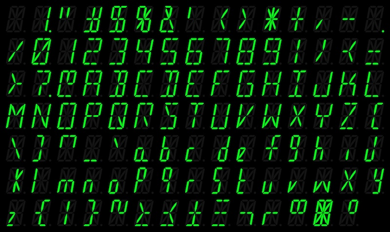

<!-- This file is rendered by https://github.com/BlvckBytes/readme_helper -->

# sixteen_segment_display

<!-- #toc -->

## Overview

The following drawing represents the dimensions of the displays I've ordered a long time ago on aliexpress.

The following high level diagram provides a quick overview of how groups of four displays each are talked to.

## PCB

### display_group

Four sixteen segment displays are considered to be a group.

### interface

The interface board drives a display group by converting the serial signal into all sixteen segments, including the decimal point, as well as each display's enabled state.

### display_group_and_interface

This board tries to combine both the [Interface](#interface)- as well as the [Display Group Board](#display_group) to save not only on space, but also on the four extra connectors. While it's getting quite crowded, this board should still be manufacturable at home.

There are 35 vias in total, of which 21 are unavoidable (16 segments, 1 decimal point, 4 ground lines, which all have to make it from the front side to the back, where the interface lives), making for 14 "additional" vias. I think that's an acceptable compromise.

### driver

Has yet to be implemented.

The driver board resembles the bridge between modern devices and the display while also handling the process of detecting the total number of displays, handling the character decoding process, multiplexing displays and playing various animations, like blinking letters or scrolling text.

## Software

### SegmentStates

This project encodes all available segment states in order to display various characters. A decoding table is then generated from this information.

### SegmentDriver

Has yet to be implemented.

This project resembles the firmware of the [Driver Board](#driver).