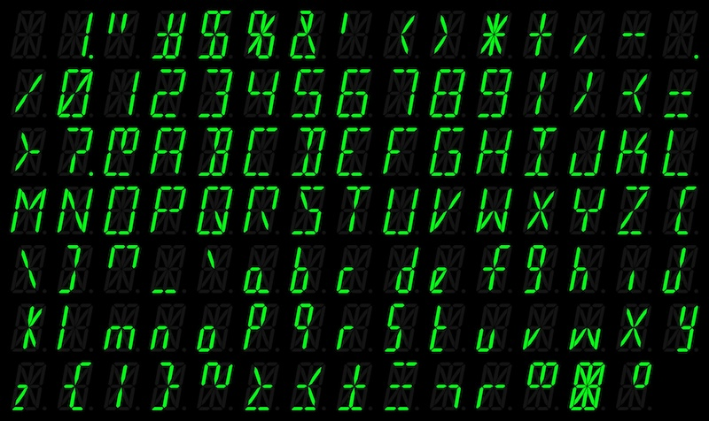

# sixteen_segment_display

## PCB

### display_group

Four sixteen segment displays are considered to be a group.

### interface

The interface board drives a display group by converting the serial signal into all sixteen segments, including the decimal point, as well as each display's enabled state.

### driver

Has yet to be implemented.

The driver board resembles the bridge between modern devices and the display while also handling the process of detecting the total number of displays, handling the character decoding process, multiplexing displays and playing various animations, like blinking letters or scrolling text.

## Software

### SegmentStates

This project encodes all available segment states in order to display various characters. A decoding table is then generated from this information.

